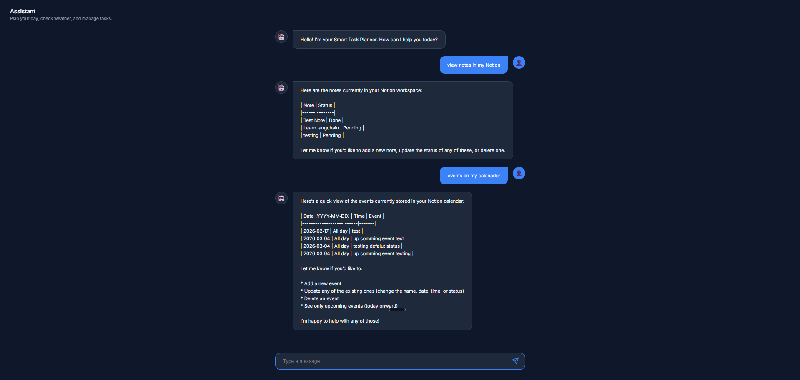

# 🤖 ReAct Agent — AI-Powered Personal Assistant

> An end-to-end **Agentic AI** application built with the **ReAct (Reason + Act)** framework - capable of managing your Notion workspace (notes & calendar) and fetching real-time weather, all through a natural language chat interface. Deployed on AWS EC2 via Docker and automated with GitHub Actions CI/CD.

---

## 📸 Preview

### Chat Interface — Live on EC2


### GitHub Actions — CI/CD Pipeline


---

## 🧠 What is ReAct (Reason + Act)?

**ReAct** is a modern agentic AI paradigm that combines **chain-of-thought reasoning** with **tool-use action loops**. Instead of a single-shot LLM response, the agent follows a structured cognitive loop:

```
Thought  →  Action  →  Observation  →  Thought  →  Action  → ... → Final Answer
```

| Step | What happens |
|---|---|
| **Thought** | The LLM reasons about what it needs to do next |
| **Action** | It selects and calls the appropriate tool |
| **Observation** | It receives the tool's output |
| **Repeat** | It reasons again based on that output |
| **Final Answer** | It synthesises everything into a natural language response |

This approach allows the agent to **break complex multi-step requests** into individual tool calls, chain them together intelligently, and explain its reasoning — far beyond what a basic prompt-response LLM can achieve.

---

## 🗂️ Project Structure

```
ReAct_Agent/
│
├── agent/
│   └── bot.py                  # Agent core: LLM + tool registration
│
├── api/
│   └── server.py               # FastAPI server with /chat and /health endpoints
│
├── tools/
│   ├── weather.py              # Weather tool (Open-Meteo API)
│   ├── notion_notes.py         # Notes CRUD tools (Notion API)
│   └── notion_calender.py      # Calendar CRUD tools (Notion API)
│
├── static/
│   ├── index.html              # Chat UI frontend
│   ├── style.css               # Styling
│   └── script.js               # Frontend logic
│
├── utils/
│   └── logger.py               # Structured application logger
│
├── assets/                     # Screenshots for documentation
├── Dockerfile                  # Container build instructions
├── docker-compose.yml          # Local container orchestration
├── requirements.txt            # Python dependencies
├── main.py                     # Application entrypoint
└── .github/workflows/
    └── deploy.yml              # GitHub Actions CI/CD pipeline
```

---

## ✨ Features

### 🗒️ Notion Notes Management
Full CRUD operations on your Notion notes database via natural language:

| Tool | What it does |
|---|---|
| `get_notes` | Fetch all notes — returns title and status (Pending / Done) |
| `add_note` | Create a new note (defaulted to Pending status) |
| `update_note_status` | Change a note's status to **Pending** or **Done** |
| `delete_note` | Archive (remove) a note by title — partial match supported |


---

### 📅 Notion Calendar Management
Full CRUD operations on your Notion calendar database:

| Tool | What it does |
|---|---|
| `get_calendar_events(date)` | Fetch events for a specific date (YYYY-MM-DD) |
| `get_all_calendar_events` | Fetch **all** events, sorted by date ascending |
| `add_calendar_event` | Add event — auto-sets status to **Upcoming** or **Done** based on date |
| `update_calendar_event` | Update any combination of name, date, time, or status |

Valid calendar statuses: `Upcoming` · `Done` · `Cancelled`


---

### 🌤️ Real-Time Weather
| Tool | What it does |
|---|---|
| `get_weather(city)` | Fetches current temperature for any city using the free [Open-Meteo API](https://open-meteo.com/) — no API key required |

The tool performs a two-step call: first geocodes the city name to coordinates, then fetches live weather data.

---

## 🏗️ Architecture

```
User (Browser)
    │
    ▼
┌──────────────────────────────────┐
│         FastAPI Server           │
│   POST /chat   GET /health       │
│   Static UI served at  /        │
└──────────────┬───────────────────┘
               │
               ▼
┌──────────────────────────────────┐
│        ReAct Agent Core          │
│  LLM: Groq (llama3-70b-8192)    │
│  Framework: LangGraph            │
│  create_react_agent()            │
└──────┬────────────────────┬──────┘
       │                    │
       ▼                    ▼
┌─────────────┐    ┌─────────────────────┐
│  Weather    │    │   Notion API         │
│  Tool       │    │  Notes + Calendar    │
│ (Open-Meteo)│    │  (REST v1 API)       │
└─────────────┘    └─────────────────────┘
```

### Key design decisions

- **LangGraph `create_react_agent`** — handles the full Thought → Action → Observation loop automatically
- **`@tool` decorator** — each tool is self-describing; the agent reads the docstring to decide when and how to use it
- **Global agent singleton** — the agent is initialised once at FastAPI startup via `@app.on_event("startup")` for performance
- **Partial match search** — note and calendar tools use Notion's `contains` filter so users don't need to type exact names
- **Auto-status on date** — calendar tools automatically set `Upcoming`/`Done` based on whether the event date is in the future or past

---

## 🛠️ Tech Stack

| Layer | Technology |
|---|---|
| **LLM** | [Groq](https://groq.com/) — ultra-fast inference |
| **Agent Framework** | [LangGraph](https://github.com/langchain-ai/langgraph) — stateful agentic workflows |
| **LLM Toolkit** | [LangChain](https://www.langchain.com/) — tools, prompts, and chain abstractions |
| **API Backend** | [FastAPI](https://fastapi.tiangolo.com/) — async Python REST API |
| **API Server** | [Uvicorn](https://www.uvicorn.org/) — ASGI server |
| **Frontend** | Vanilla HTML / CSS / JavaScript |
| **Data Sources** | [Notion API](https://developers.notion.com/) · [Open-Meteo](https://open-meteo.com/) |
| **Containerization** | [Docker](https://www.docker.com/) + Docker Compose |
| **Container Registry** | GitHub Container Registry (GHCR) |
| **Cloud Hosting** | AWS EC2 |
| **CI/CD** | GitHub Actions |
| **Package Manager** | [uv](https://github.com/astral-sh/uv) — ultra-fast Python package installer |
| **Logging** | Python `logging` with structured stdout formatter |

---

## 🔄 Agentic Workflow — Step by Step

Here's what happens when a user sends: *"What are my pending notes and what's the weather in New York?"*

```
1. User sends message via chat UI
   └─▶ POST /chat { "message": "..." }

2. FastAPI passes message to the ReAct agent

3. Agent THINKS:
   "I need to fetch notes AND weather. Two tool calls needed."

4. Agent ACTS → calls get_notes()
   └─▶ Notion API returns: [{"note": "Buy groceries", "status": "Pending"}, ...]

5. Agent OBSERVES the result, THINKS again:
   "Got notes. Now fetch weather."

6. Agent ACTS → calls get_weather("New York")
   └─▶ Open-Meteo API returns: {"city": "New York", "temp": 3.2, "unit": "C"}

7. Agent OBSERVES, THINKS:
   "I have all the information. I can now give a final answer."

8. Agent generates a natural language response combining both results

9. FastAPI returns { "response": "..." } to the browser
```

The entire loop is powered by **LangGraph's prebuilt ReAct agent**, which manages the state machine, tool dispatch, and response synthesis without any custom orchestration code.

---

## 🐳 Docker & Deployment

### Local Development

```bash
# Clone the repo
git clone https://github.com/LeelaKarthik-26/ReAct_Agent.git
cd ReAct_Agent

# Create .env file (see Environment Variables section)
cp .env.example .env   # fill in your API keys

# Run with Docker Compose
docker-compose up --build

# Visit
open http://localhost:8000
```

### Dockerfile Overview

```dockerfile
FROM python:3.12-slim
WORKDIR /app
RUN apt-get update && apt-get install -y git && rm -rf /var/lib/apt/lists/*
RUN pip install uv
COPY requirements.txt .
RUN uv pip install --system -r requirements.txt
COPY . .
EXPOSE 8000
CMD ["python", "main.py"]
```

- Uses `python:3.12-slim` for a minimal image footprint
- Uses **`uv`** instead of `pip` for dramatically faster dependency resolution
- Multi-stage-friendly structure (copy requirements before source for Docker layer caching)

---

## ⚙️ CI/CD Pipeline — GitHub Actions

Every push to `master` triggers the full pipeline automatically:

```
Push to master
    │
    ▼
┌─────────────────────────────┐
│  Job 1: build-and-push      │
│  ─────────────────────────  │
│  1. Checkout code           │
│  2. Login to GHCR           │
│  3. Build Docker image      │
│  4. Push → ghcr.io/...      │
└──────────┬──────────────────┘
           │  (needs: build-and-push)
           ▼
┌─────────────────────────────┐
│  Job 2: deploy              │
│  ─────────────────────────  │
│  1. SSH into AWS EC2        │
│  2. docker stop old container│
│  3. docker pull new image   │
│  4. docker run with env vars│
└─────────────────────────────┘
```

**Zero-downtime rolling deploy** — the old container is stopped, removed, and replaced with the new image in under 30 seconds.

---

## 🔐 Environment Variables

| Variable | Description |
|---|---|
| `GROQ_API_KEY` | API key from [console.groq.com](https://console.groq.com) |
| `NOTION_API_KEY` | Notion integration token from [notion.so/my-integrations](https://www.notion.so/my-integrations) |
| `NOTION_NOTES_DB_ID` | ID of your Notion notes database |
| `NOTION_CALENDAR_DB_ID` | ID of your Notion calendar database |

> ⚠️ Never commit your `.env` file. It is listed in `.gitignore`.

---

## 📡 API Endpoints

| Method | Endpoint | Description |
|---|---|---|
| `GET` | `/` | Serves the chat UI (static frontend) |
| `POST` | `/chat` | Send a message to the agent |
| `GET` | `/health` | Health check — returns `{"status": "ok"}` |

### Chat Request / Response

```json
// POST /chat
{
  "message": "What are my upcoming events this week?",
  "history": []
}

// Response
{
  "response": "You have 2 upcoming events this week: ..."
}
```

---

## 💡 Example Conversations

```
User: "Add a note to call the dentist"
Agent: "Added note 'Call the dentist' with status Pending ✅"

User: "What are my notes?"
Agent: "You have 3 notes:
  - Call the dentist (Pending)
  - Buy groceries (Pending)
  - Read LangGraph docs (Done)"

User: "Mark 'Buy groceries' as done"
Agent: "Updated note 'Buy groceries' status to Done ✅"

User: "Schedule a team meeting on March 10th at 10:00"
Agent: "Added Event: 'Team meeting' at 10:00 on 2026-03-10 with status 'Upcoming' ✅"

User: "What's the weather in London?"
Agent: "The current temperature in London is 8.4°C."

User: "Cancel the team meeting"
Agent: "Updated event 'Team meeting': status → 'Cancelled' ✅"
```

---

## 🚀 Getting Started (Without Docker)

```bash
# 1. Clone
git clone https://github.com/LeelaKarthik-26/ReAct_Agent.git
cd ReAct_Agent

# 2. Create virtual environment
python -m venv .venv
source .venv/bin/activate   # Windows: .venv\Scripts\activate

# 3. Install dependencies
pip install uv
uv pip install -r requirements.txt

# 4. Set up .env with your API keys

# 5. Run
python main.py

# 6. Open browser
open http://localhost:8000
```

---

## 📚 Key Concepts & References

| Concept | Reference |
|---|---|
| ReAct Prompting | [ReAct: Synergizing Reasoning and Acting in Language Models (Yao et al., 2022)](https://arxiv.org/abs/2210.03629) |
| LangGraph Agents | [LangGraph Docs — Prebuilt ReAct Agent](https://langchain-ai.github.io/langgraph/reference/prebuilt/) |
| Agentic Workflows | [Andrew Ng — Agentic Design Patterns](https://www.deeplearning.ai/the-batch/how-agents-can-improve-llm-performance/) |
| Notion API | [Notion Developers Documentation](https://developers.notion.com/) |
| Open-Meteo | [Open-Meteo Free Weather API](https://open-meteo.com/) |

---

## 🏆 Why This Project Stands Out

- ✅ **End-to-end production system** — not a notebook demo; it's a containerised, deployed, live application
- ✅ **Real agentic reasoning** — the agent dynamically decides which tools to call and in what order
- ✅ **Full CI/CD pipeline** — code pushed to GitHub automatically builds, pushes to GHCR, and deploys to AWS
- ✅ **Clean tool architecture** — each tool is a self-contained, documented, independently testable function
- ✅ **Real-world integrations** — Notion API, Open-Meteo API, Groq LLM
- ✅ **Production patterns** — structured logging, startup lifecycle hooks, error handling, graceful Docker restarts

---

## 👤 Author

**LeelaKarthik Devisetty**  
AI/ML Engineer · Building intelligent agentic systems  

[](https://github.com/LeelaKarthik-26)

---

<p align="center">
  <em>Built with 🧠 LangGraph · ⚡ Groq · 🐳 Docker · ☁️ AWS EC2</em>
</p>